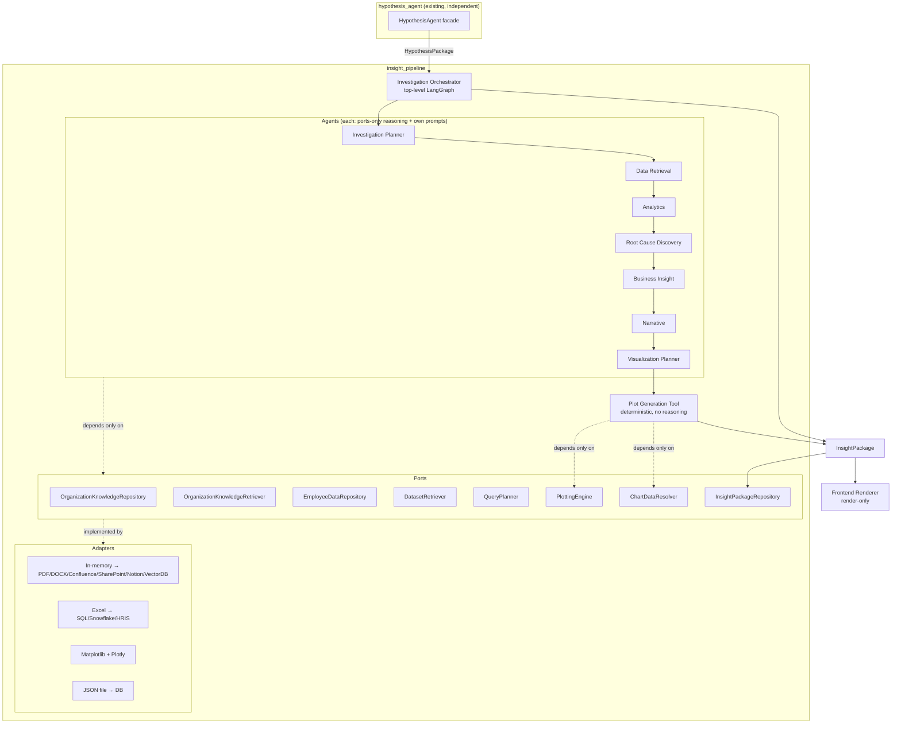
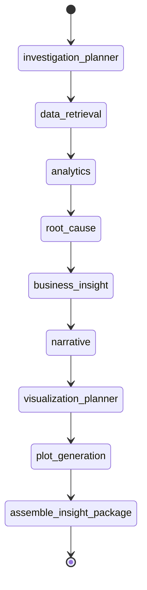
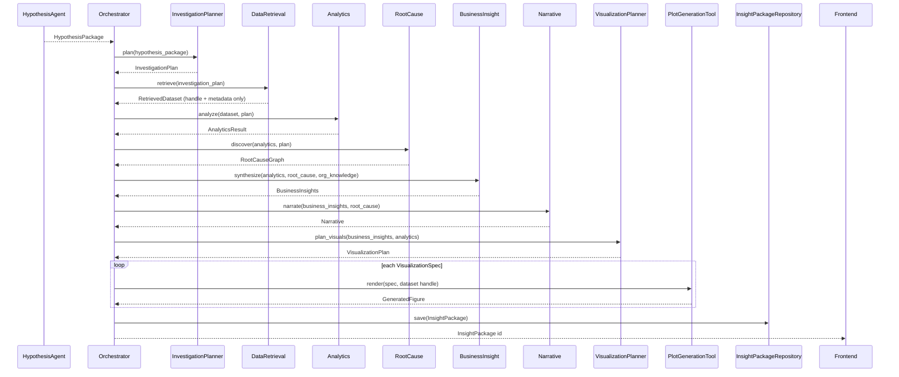

# Delphi Platform Architecture — from Hypothesis Engine to Organizational Intelligence Platform

Status: **design only — no implementation yet.** This document extends
[hypothesis_agent/docs/ARCHITECTURE.md](../hypothesis_agent/docs/ARCHITECTURE.md)
(unchanged, still authoritative for the Hypothesis Agent itself) with the
full downstream pipeline. Implementation begins only once this is reviewed.

## 0. Framing

Treat this not as "a pile of LLM agents" but as a **digital organizational
consulting firm**: each stage has one job, a typed contract for its input
and output, and no knowledge of how any other stage does its work. The
Hypothesis Agent decides *what's worth investigating*. Every stage after it
progressively turns that into evidence, explanation, business meaning,
narrative, and presentation-ready artifacts — ending in one object the
frontend can render without ever touching analytics, plotting, or an LLM
itself.

```
Organization Metadata / Policy Docs / Culture Docs / Employee DB / Historical Memory
        │
        ▼
   Hypothesis Agent  (existing, untouched, still independent)
        │
        ▼
   HypothesisPackage
        │
════════════════════════════ Investigation Pipeline (new) ════════════════════════════
        │
        ▼
Investigation Planner Agent → InvestigationPlan
        ▼
Data Retrieval Agent → RetrievedDataset
        ▼
Analytics Agent → AnalyticsResult
        ▼
Root Cause Discovery Agent → RootCauseGraph
        ▼
Business Insight Agent → BusinessInsights
        ▼
Narrative Agent → Narrative
        ▼
Visualization Planner Agent → VisualizationPlan
        ▼
Plot Generation Tool (deterministic, not an agent) → GeneratedFigure[]
        ▼
   InsightPackage  (Executive Report Package)
        ▼
   Frontend Renderer (render-only, no reasoning/analytics/plotting client-side)
```

## 1. Non-negotiables carried over from the Hypothesis Agent

These constraints from [hypothesis_agent/docs/ARCHITECTURE.md §1-2](../hypothesis_agent/docs/ARCHITECTURE.md)
apply identically to every new component:

1. **Ports → Adapters → Reasoning → Contracts.** No reasoning-layer or
   contract module imports `pandas`, SQL drivers, `matplotlib`, `plotly`,
   or any storage/database SDK. Those live only in adapters.
2. **The Hypothesis Agent stays completely independent.** Nothing downstream
   is imported by it; it doesn't know the pipeline past it exists.
   Downstream code depends *on* `hypothesis_agent.contracts` (pure Pydantic,
   already dependency-free), never the reverse.
3. **Everything works with mock/offline adapters today** and swaps to real
   systems later with zero reasoning-layer changes — same discipline that
   made `MockLLMService` + `HashEmbeddingService` + `InMemory*Repository`
   the default in the Hypothesis Agent.
4. **Plugin registries, not hardcoded workflows.** Every extensible
   decision (which analysis method, which chart, which root-cause strategy,
   which narrative style) is a registry lookup, config-driven.
5. **Deep Agents / Strands used deliberately, not everywhere** — behind a
   port, with a plain-LLM-call fallback, exactly like
   `DeepAgentUnderstandingEngine` / `StrandsCriticOrchestrator` today.

## 2. A new, deliberate data-access boundary

The Hypothesis Agent's `EmployeeRepository` returns only a schema-level
`EmployeeDataLandscape` — never a row. That boundary does **not** change.
Instead, the pipeline adds a **second, separate** boundary one step later:

- **Before a hypothesis exists**: only landscape/schema access
  (`hypothesis_agent.ports.EmployeeRepository`) — the Hypothesis Agent is
  never authorized to see a single employee record.
- **After a hypothesis is chosen and an `InvestigationPlan` scopes exactly
  what's needed**: the pipeline is allowed to resolve actual data, but only
  behind a new `insight_pipeline.ports.EmployeeDataRepository` +
  `DatasetRetriever`, and even then the *reasoning* layers (Analytics,
  Root Cause, Business Insight, Narrative, Visualization Planner) never see
  raw rows directly — they see a `DatasetHandle` (an opaque reference) plus
  metadata, and only adapter-internal code (inside the Analytics Agent's
  method plugins, and inside the Plot Generation Tool's data resolver)
  actually loads rows into a dataframe-like structure. This is the same
  "reasoning never touches the raw table" discipline as the Hypothesis
  Agent, applied one stage later where it becomes unavoidable to *use* the
  data rather than just describe it.

This is a load-bearing design decision, not incidental — it's what lets
`InvestigationPlan`, `RetrievedDataset`, `AnalyticsResult`, `RootCauseGraph`,
etc. stay plain, small, JSON-serializable Pydantic objects that flow cleanly
through LangGraph state and a REST API, instead of ballooning into
data-carrying blobs.

## 3. Repository / package structure

A new sibling package, **`insight_pipeline`**, holds everything downstream
of the Hypothesis Agent. It depends on `hypothesis_agent` (installs it as a
library, imports only `hypothesis_agent.contracts` and the generic
`hypothesis_agent.ports.EmbeddingService`/`LLMService` — both already
adapter-agnostic and safe to reuse rather than reinvent). `hypothesis_agent`
never imports `insight_pipeline`.

Each `agents/<name>/` submodule internally mirrors the Hypothesis Agent's
own shape (`reasoning/`, `prompts/`, a small graph or facade) so it can be
**lifted out into its own deployable package/service later with no
redesign** — it only ever imports `insight_pipeline.contracts` /
`insight_pipeline.ports`, never a sibling agent's internals.

```
Delphi/
├── hypothesis_agent/                    # existing, untouched
├── insight_pipeline/                    # NEW
│   ├── pyproject.toml                   # depends on hypothesis-agent, langgraph, pydantic, ...
│   ├── docs/
│   │   └── (agent-specific notes; platform-level design stays in ../../docs/PLATFORM_ARCHITECTURE.md)
│   ├── src/insight_pipeline/
│   │   ├── contracts/                   # shared cross-agent data contracts (§5, §6)
│   │   │   ├── organization_knowledge.py
│   │   │   ├── investigation.py         # InvestigationPlan
│   │   │   ├── dataset.py               # DatasetMetadata, DatasetHandle, RetrievedDataset
│   │   │   ├── analytics.py             # AnalyticsResult, AnalysisMethodResult
│   │   │   ├── root_cause.py            # RootCauseGraph, CausalNode, CausalEdge
│   │   │   ├── business_insight.py      # BusinessInsights, BusinessFinding, Recommendation
│   │   │   ├── narrative.py             # Narrative
│   │   │   ├── visualization.py         # VisualizationPlan, VisualizationSpec, GeneratedFigure, ChartTheme
│   │   │   └── insight_package.py       # InsightPackage (the final contract)
│   │   ├── ports/                       # interfaces every adapter below implements
│   │   │   ├── organization_knowledge_repository.py
│   │   │   ├── organization_knowledge_retriever.py
│   │   │   ├── employee_data_repository.py
│   │   │   ├── dataset_retriever.py
│   │   │   ├── query_planner.py
│   │   │   ├── plotting_engine.py
│   │   │   ├── chart_data_resolver.py
│   │   │   └── insight_package_repository.py
│   │   ├── plugins/                     # generic PluginRegistry[T] families (§13)
│   │   │   ├── analysis_methods/        # AnalysisMethodPlugin + built-ins
│   │   │   ├── visualization_recommenders/
│   │   │   ├── business_evaluators/
│   │   │   ├── root_cause_strategies/
│   │   │   ├── narrative_strategies/
│   │   │   └── knowledge_retrieval/
│   │   ├── adapters/                    # concrete, swappable implementations
│   │   │   ├── organization_knowledge/  # in-memory (today) → PDF/DOCX/Confluence/SharePoint/Notion/vector-DB (later)
│   │   │   ├── employee_data/           # excel (today, reuses Book1.xlsx pattern) → SQL/Snowflake/HRIS (later)
│   │   │   ├── plotting/                # matplotlib (static) + plotly (interactive)
│   │   │   └── insight_store/           # JSON-file-backed (today, mirrors JsonHypothesisStore) → DB (later)
│   │   ├── agents/
│   │   │   ├── investigation_planner/   # reasoning/, prompts/, facade.py
│   │   │   ├── data_retrieval/
│   │   │   ├── analytics/
│   │   │   ├── root_cause/
│   │   │   ├── business_insight/
│   │   │   ├── narrative/
│   │   │   └── visualization_planner/
│   │   ├── tools/
│   │   │   └── plot_generation/         # deterministic — no LLM, no reasoning (§12)
│   │   ├── orchestrator/                # top-level LangGraph tying stages together (§14)
│   │   ├── di/                          # container wiring for the whole platform
│   │   └── server/                      # extends the API: POST /api/investigate, GET /api/insights/{id}
│   └── tests/
│       ├── unit/                        # per-contract, per-plugin, offline
│       └── integration/                 # full pipeline, MockLLMService + mock adapters, offline
└── docs/
    └── PLATFORM_ARCHITECTURE.md         # this document
```

## 4. Layered architecture (extended)



## 5. Organization Knowledge

A new knowledge source, independent of the competency-framework metadata the
Hypothesis Agent already reasons over. It is **retrieved, not dumped into
prompts** — every consumer gets back a short, relevant, cited list of
knowledge chunks for its specific question, not a wall of policy text.

### 5.1 Contracts (`contracts/organization_knowledge.py`)

```python
class OrganizationKnowledgeDocument(BaseModel):
    id: str
    organization_id: str
    category: Literal[
        "hr_policy", "promotion_policy", "compensation_policy",
        "competency_framework", "leadership_philosophy", "company_values",
        "culture_handbook", "onboarding_guide", "internal_documentation",
        "organizational_objectives", "mission", "vision",
        "behavioral_expectations",
    ]
    title: str
    source_uri: str | None = None      # file path / Confluence page / SharePoint URL, etc.
    content: str                        # full or chunked text
    metadata: dict[str, Any] = {}

class OrganizationKnowledge(BaseModel):
    """One retrieved, query-relevant chunk — what agents actually consume."""
    document_id: str
    category: str
    title: str
    excerpt: str
    relevance_score: float
    source_uri: str | None = None
```

### 5.2 Ports

| Port | Method | Notes |
|---|---|---|
| `OrganizationKnowledgeRepository` | `get_document(id)`, `list_documents(organization_id, category=None)` | Raw storage access — analogous to `HistoricalMemoryRepository.list_recent`. |
| `OrganizationKnowledgeRetriever` | `retrieve(query, organization_id, top_k) -> list[OrganizationKnowledge]` | Semantic search — analogous to `HistoricalMemoryRepository.search_similar`. Embedding-based; reuses `hypothesis_agent.ports.EmbeddingService` rather than redefining it. |

### 5.3 Adapters

- **Today**: `InMemoryOrganizationKnowledgeRepository` (a fixture list of
  documents) + an embedding-based retriever built the same way
  `JsonHypothesisStore.search_similar` already works (embed each document
  chunk on the fly, cosine similarity, top-k) — zero new infrastructure,
  reuses the existing `EmbeddingService` port.
- **Later, no redesign needed**: PDF/DOCX parsers (chunk → `OrganizationKnowledgeDocument`),
  Confluence/SharePoint/Notion connectors (poll or webhook → same target
  shape), a real vector DB (pgvector/Pinecone/Weaviate) implementing
  `OrganizationKnowledgeRetriever` directly.

### 5.4 Why this matters (consulting-quality insight)

```
Policy:    "Internal mobility is encouraged."
Analysis:  Internal mobility is measured at 4% annually — extremely low.
Insight:   "The organization is operating inconsistently with its own
            stated mobility policy" — a materially stronger, more specific
            finding than either fact alone.
```

Every downstream agent (Investigation Planner, Root Cause, Business
Insight, Narrative) may call `OrganizationKnowledgeRetriever.retrieve()`
with its own query; none of them require it (empty repository ⇒ agents
degrade gracefully to reasoning without policy context, same
empty-repository discipline as `HistoricalMemoryRepository`).

## 6. `HypothesisPackage` extension — backward compatible

No existing field changes meaning or type. One new **optional** field is
added to `hypothesis_agent.contracts.HypothesisPackage`:

```python
class InvestigationSeed(BaseModel):
    """Forward-looking hints the Hypothesis Agent's own reasoning already
    surfaces, before any investigation has run. Entirely optional — nothing
    downstream may treat these as authoritative; InvestigationPlanner
    re-derives its own plan and may agree, extend, or ignore these."""
    expected_investigation_objectives: list[str] = []
    potential_organizational_risks: list[str] = []
    potential_organizational_opportunities: list[str] = []
    suggested_organizational_questions: list[str] = []
    suggested_statistical_analyses: list[str] = []
    suggested_visualization_themes: list[str] = []
    relevant_organizational_policies: list[str] = []
    relevant_organizational_constructs: list[str] = []
    business_context: str = ""

class HypothesisPackage(BaseModel):
    ...  # every existing field unchanged
    investigation_seed: InvestigationSeed | None = None
```

This is populated by a **new, optional** `finalize`-adjacent step inside the
Hypothesis Agent (one more structured LLM call, same pattern as the
headline/summary step already added) — but that step, its prompt, and this
field are all owned by `hypothesis_agent`, not `insight_pipeline`; the
Hypothesis Agent still has zero knowledge that anything downstream exists.
`DownstreamHints` (already shipped) is untouched — `InvestigationSeed` is
richer and additive, not a replacement.

## 7. Investigation Planner Agent

**Input**: `HypothesisPackage` (+ optional `OrganizationKnowledge` context).
**Output**: `InvestigationPlan`. **Never touches data.** Its only question:
*"what information is required to validate this hypothesis?"*

```python
class VariableSpec(BaseModel):
    name: str
    role: Literal["independent", "dependent", "moderator", "mediator", "control"]
    expected_type: Literal["numeric", "categorical", "ordinal", "boolean", "text", "datetime"]
    data_category: str  # matches EmployeeDataLandscape / AttributeField categories where possible

class PopulationSpec(BaseModel):
    description: str
    inclusion_criteria: list[str] = []
    exclusion_criteria: list[str] = []

class InvestigationPlan(BaseModel):
    id: str
    hypothesis_package_id: str
    variables_required: list[VariableSpec]
    target_population: PopulationSpec
    segmentation_strategy: list[str] = []
    potential_confounders: list[str] = []
    filtering_rules: list[str] = []
    statistical_questions: list[str] = []
    business_questions: list[str] = []
    validation_strategy: str
    recommended_analysis_types: list[str] = []
    potential_risks: list[str] = []
    suggested_visualizations: list[str] = []
    relevant_knowledge: list[OrganizationKnowledge] = []
    provenance: dict[str, Any] = {}
```

**Framework choice**: Deep Agents. This step benefits from planning +
sub-task breakdown (variables, population, confounders, validation strategy
are semi-independent sub-problems) the same way `DeepAgentUnderstandingEngine`
benefits `understand_organization` — this is the pipeline's second "gather
and synthesize before anything concrete exists" step. Falls back to a
single structured `LLMService.complete_structured` call
(`DirectLLMInvestigationPlanner`) if Deep Agents isn't installed, identical
fallback discipline to the Hypothesis Agent.

## 8. Data Retrieval Agent

**Input**: `InvestigationPlan`. **Output**: `RetrievedDataset`. **No
statistical reasoning happens here** — purely "get the right data, scoped
to exactly what was asked for."

```python
class DatasetHandle(BaseModel):
    """An opaque reference — never raw rows. Only adapter-internal code
    resolves this into an actual in-memory table."""
    backend: str            # "excel" | "sql" | "snowflake" | ...
    location: str            # adapter-specific: file path, table name, query id
    row_count: int
    resolved_at: datetime

class DatasetMetadata(BaseModel):
    fields: list[AttributeField]  # reuses hypothesis_agent's AttributeField shape
    population_description: str
    coverage_notes: str = ""

class RetrievedDataset(BaseModel):
    id: str
    investigation_plan_id: str
    handle: DatasetHandle
    metadata: DatasetMetadata
    retrieval_query_summary: str
```

### Ports

| Port | Method | Today | Tomorrow |
|---|---|---|---|
| `EmployeeDataRepository` | `resolve(query: RetrievalQuery) -> DatasetHandle` | `ExcelEmployeeDataRepository` (reuses the `Book1.xlsx` loading pattern from `hypothesis_agent.adapters.shl_sample_cohort`, but now returns a real, scoped, loadable handle instead of only a landscape) | SQL / Snowflake / data-lake / HRIS adapters — same port |
| `QueryPlanner` | `plan(investigation_plan, dataset_metadata) -> RetrievalQuery` | Rule/LLM-assisted mapping of `VariableSpec.name` → actual available field names | unchanged as sources change |
| `DatasetRetriever` | `retrieve(query) -> RetrievedDataset` | Orchestrates `QueryPlanner` + `EmployeeDataRepository` | unchanged |

**Framework choice**: Strands SDK. This is fundamentally "call the right
tool(s) to fetch the right thing" — Strands' tool-calling agent loop fits
better here than a heavyweight planning framework. One Strands tool per
registered `EmployeeDataRepository` backend; the agent decides which to call
based on `RetrievalQuery`. Falls back to direct sequential port calls
(`DirectDatasetRetriever`) with no LLM at all when the query plan is
unambiguous (the common case) — this agent doesn't strictly need an LLM in
the loop most of the time, which is itself worth stating explicitly: **not
every "agent" in this pipeline needs to reason on every call**.

## 9. Analytics Agent

**Input**: `RetrievedDataset` + `InvestigationPlan`. **Output**: `AnalyticsResult`.

```python
class AnalysisMethodResult(BaseModel):
    method: str
    variables_involved: list[str]
    statistic: float | None = None
    p_value: float | None = None
    effect_size: float | None = None
    confidence_interval: tuple[float, float] | None = None
    interpretation_notes: str
    caveats: list[str] = []

class AnalyticsResult(BaseModel):
    id: str
    investigation_plan_id: str
    dataset_id: str
    methods_run: list[AnalysisMethodResult]
    data_quality_notes: list[str] = []
    limitations: list[str] = []
```

### Plugin family: `AnalysisMethodPlugin`

Same shape as the Hypothesis Agent's `Evaluator` plugins — one
implementation per method, uniform interface, registered in a
`PluginRegistry[AnalysisMethodPlugin]`:

```python
class AnalysisMethodPlugin(ABC):
    method_name: str
    async def is_applicable(self, plan: InvestigationPlan, metadata: DatasetMetadata) -> bool: ...
    async def run(self, handle: DatasetHandle, plan: InvestigationPlan) -> AnalysisMethodResult: ...
```

Built-in plugins (each its own small adapter file, pandas/numpy/statsmodels/
sklearn strictly internal to that file): `CorrelationPlugin`,
`RegressionPlugin`, `ANOVAPlugin`, `ChiSquarePlugin`, `ClusteringPlugin`,
`SurvivalAnalysisPlugin`, `FeatureImportancePlugin`, `TimeSeriesPlugin`,
`MixedEffectsPlugin`, `DimensionalityReductionPlugin`, `DecisionTreePlugin`
— adding a new method later is one new plugin file + a registry line, no
change to the Analytics Agent itself.

**Selection + execution flow**: an LLM (or a rule-based fallback keyed off
`VariableSpec.expected_type` combinations) picks which registered plugins
are applicable for this specific hypothesis/population/dataset via
`is_applicable`; applicable plugins then **run concurrently**
(`asyncio.gather`, same pattern already used for the Hypothesis Agent's
dimension evaluators) rather than sequentially.

**Framework choice**: Strands SDK, optional — an alternate
`StrandsAnalysisOrchestrator` can expose each plugin as a Strands tool for
cases where method *selection* itself benefits from a tool-calling loop
(e.g., iteratively deciding "try regression, inspect residuals, then decide
whether clustering is also warranted"). Default path stays the simpler
LLM-picks-then-gather flow above — most investigations don't need that.

## 10. Root Cause Discovery Agent

**Input**: `AnalyticsResult` + `InvestigationPlan` + relevant
`OrganizationKnowledge`. **Output**: `RootCauseGraph`. This is explicitly
**not** "summarize the statistics" — it's mechanism discovery.

```python
class CausalNode(BaseModel):
    id: str
    name: str
    node_type: Literal["driver", "mediator", "moderator", "outcome", "bottleneck"]
    description: str

class CausalEdge(BaseModel):
    source: str
    target: str
    relationship_type: Literal["causes", "mediates", "moderates", "correlates_with"]
    strength: float
    confidence: float
    evidence_refs: list[str] = []

class RootCauseGraph(BaseModel):
    id: str
    nodes: list[CausalNode]
    edges: list[CausalEdge]
    potential_mechanisms: list[str]
    supporting_evidence: list[str]
    alternative_explanations: list[str]
    confidence: float
```

### Plugin family: `RootCauseStrategyPlugin`

Different strategies for proposing causal structure, uniform interface,
pluggable — e.g. `LLMMechanismBrainstormPlugin` (default),
`MediationAnalysisPlugin` (statistical, once the Analytics Agent has run
mediation tests), and a **future** `StatisticalCausalDiscoveryPlugin` (e.g.
a PC-algorithm-style structure-learning method) — added later with zero
change to the agent itself.

**Framework choice**: Deep Agents — the flagship use case in this whole
pipeline. Root cause discovery over an organizational system (burnout →
communication → manager quality → promotion delay → customer load → remote
work → leadership, per the brief's own example) is exactly the kind of
open-ended, multi-angle exploration Deep Agents' sub-agent delegation is
for: one sub-agent explores mediators, one checks alternative/confounding
explanations, one checks consistency against `OrganizationKnowledge`, a
final pass assembles the graph. Falls back to a single structured
LLM call (`DirectLLMRootCauseEngine`) producing a flatter graph when Deep
Agents isn't available.

## 11. Business Insight Agent

**Input**: `AnalyticsResult` + `RootCauseGraph` + `OrganizationKnowledge`
(+ `HypothesisPackage` for framing). **Output**: `BusinessInsights`. This is
consulting synthesis, not statistical reporting.

```python
class BusinessFinding(BaseModel):
    statement: str
    evidence_refs: list[str]
    confidence: float

class BusinessRisk(BaseModel):
    description: str
    severity: Literal["low", "medium", "high", "critical"]
    likelihood: Literal["low", "medium", "high"]
    affected_population: str

class BusinessOpportunity(BaseModel):
    description: str
    potential_value: str
    feasibility: Literal["low", "medium", "high"]

class Recommendation(BaseModel):
    action: str
    rationale: str
    priority: int
    expected_roi: str | None = None
    owner_suggestion: str | None = None

class BusinessInsights(BaseModel):
    id: str
    findings: list[BusinessFinding]
    risks: list[BusinessRisk]
    opportunities: list[BusinessOpportunity]
    financial_impact: str | None = None       # range-based prose, never a false-precision number
    organizational_impact: str
    employee_impact: str
    strategic_recommendations: list[Recommendation]
    priority_ranking: list[str]                # ordered Recommendation identifiers
```

### Plugin family: `BusinessEvaluatorPlugin`

Mirrors the Hypothesis Agent's `Evaluator` pattern again: one plugin per
"consulting lens" — `FinancialImpactEvaluator`, `RiskEvaluator`,
`OpportunityEvaluator`, `ROIEstimator` — run over the same
`AnalyticsResult`/`RootCauseGraph`, merged into one `BusinessInsights`.

**Framework choice**: explicit LangGraph subgraph (findings → risks →
opportunities → financial impact → prioritization), the same disciplined,
inspectable multi-step shape as the Hypothesis Agent's own search loop,
rather than one black-box call. Deep Agents is an option for the
"risk/opportunity discovery" sub-step specifically if a single organization
has enough surface area to warrant it — not the default.

## 12. Narrative Agent

**Input**: `BusinessInsights` + `RootCauseGraph` + `AnalyticsResult`
(+ `HypothesisPackage`). **Output**: `Narrative`. Turns isolated findings
into one story, not a bulleted list.

```python
class Narrative(BaseModel):
    id: str
    executive_summary: str
    storyline: list[str]          # ordered narrative beats
    key_messages: list[str]
    business_narrative: str        # full prose
    supporting_evidence: list[str]
    contradictions: list[str]      # honest tensions/caveats, not hidden
    future_questions: list[str]
```

### Plugin family: `NarrativeStrategyPlugin`

Pluggable narrative framings — `RiskLedNarrativeStrategy`,
`OpportunityLedNarrativeStrategy`, `BalancedNarrativeStrategy` — same
registry pattern.

**Framework choice**: Deep Agents, optional — long-form synthesis benefits
from a draft → self-critique → revise loop (conceptually the same
draft/critique/improve shape the Hypothesis Agent's own search loop already
uses, just applied to prose instead of a hypothesis statement). Default:
one structured LLM call for determinism and cost; Deep Agents opt-in via
config for higher-stakes reports.

## 13. Visualization Planner Agent

**Input**: `BusinessInsights` + `AnalyticsResult` + `RootCauseGraph`.
**Output**: `VisualizationPlan`. Decides **what** to show, never **how** —
no chart is rendered here.

```python
class VisualizationSpec(BaseModel):
    id: str
    title: str
    business_objective: str
    variables: list[str]
    visualization_type: str   # see the catalog in §14 — a registry key, not a hardcoded enum
    reason: str
    priority: int
    executive_message: str
    expected_insight: str
    data_requirements: list[str]   # fields/aggregations PlottingEngine's resolver needs

class VisualizationPlan(BaseModel):
    id: str
    specs: list[VisualizationSpec]
```

### Plugin family: `VisualizationRecommenderPlugin`

Default: LLM-based reasoning proposing however many specs the evidence
actually warrants — **the planner optimizes communication quality, not
plot count**; one hypothesis might justify 3 charts, another 10. A
rule-based fallback recommender (mirroring `FeasibilityFromLandscapeEvaluator`'s
non-LLM pattern) can propose a minimal, safe default set (e.g. one bar
chart per categorical finding) when no LLM is configured.

**Framework choice**: Strands SDK, optional — chart-type proposal is a
natural fit for a tool-calling loop (`propose_visualization` called once
per warranted chart) if the plan grows complex; default stays a single
structured LLM call returning the whole `VisualizationSpec` list, same
list-generation shape as `generate_candidate`.

## 14. Plot Generation Tool — deterministic, not an agent

**Input**: `VisualizationSpec` + `DatasetHandle` (resolved internally).
**Output**: `GeneratedFigure`. **Contains no reasoning whatsoever** — the
agent decides, the tool executes.

```python
class ResolvedChartData(BaseModel):
    """Small, chart-ready, framework-agnostic data — aggregated/shaped, not
    raw rows. The only thing that crosses back from adapter-land into a
    contract."""
    categories: list[str] = []
    series: dict[str, list[float]] = {}
    raw_points: list[tuple[float, float]] | None = None  # for scatter/bubble

class ChartTheme(BaseModel):
    """Configuration-driven professional styling — never hardcoded per
    chart. One theme, applied consistently across every figure in a report."""
    palette: list[str]
    font_family: str
    title_style: dict[str, Any]
    annotation_style: dict[str, Any]

class GeneratedFigure(BaseModel):
    id: str
    spec_id: str          # -> VisualizationSpec.id
    format: Literal["png", "svg", "pdf", "html"]
    file_ref: str          # path or URI — never inline megabytes in the contract
    caption: str
    alt_text: str
```

### Ports

| Port | Method | Adapters |
|---|---|---|
| `ChartDataResolver` | `resolve(spec, handle) -> ResolvedChartData` | Adapter-internal pandas/numpy aggregation — the one place per figure that touches the dataframe |
| `PlottingEngine` | `render(spec, data, theme) -> GeneratedFigure` | `MatplotlibPlottingEngine` (static, publication-quality: PNG/SVG/PDF), `PlotlyPlottingEngine` (interactive HTML) |

### Chart type catalog (registry keys, not a hardcoded switch statement)

Bar · Grouped bar · Stacked bar · Line · Area · Scatter · Bubble · Heatmap ·
Correlation matrix · Boxplot · Violin · Ridgeline · Treemap · Sunburst ·
Sankey · Network graph · Radar · Parallel coordinates · Feature importance ·
SHAP · Decision tree · Timeline · Waterfall · Funnel · Executive KPI card ·
Histogram · Density · Hexbin · Pairplot · Cluster visualization.

Each is a small adapter registered under its `visualization_type` key in a
`PluginRegistry[ChartRenderer]` — adding a new chart type is one new
adapter + one registry line, never a change to `VisualizationSpec` or the
Visualization Planner.

### Professional styling

One shared `ChartTheme` (McKinsey/BCG/Bain/Deloitte/PwC/EY/Accenture-style:
consistent typography, generous spacing, direct data-label annotations
instead of legends where possible, executive-readable titles, callout
boxes for the single number that matters) is loaded from config and applied
by every `PlottingEngine` adapter — never per-chart hardcoded styling, and
never bare `matplotlib` defaults.

## 15. `InsightPackage` — the Executive Report Package

The single object the frontend ever consumes. Everything needed to render
a full report lives inside it; the frontend never calls analytics,
plotting, or an LLM.

```python
class InsightPackage(BaseModel):
    id: str
    hypothesis_package: HypothesisPackage
    investigation_plan: InvestigationPlan
    analytics_results: AnalyticsResult
    root_cause_graph: RootCauseGraph
    business_insights: BusinessInsights
    narrative: Narrative
    visualization_plan: VisualizationPlan
    generated_figures: list[GeneratedFigure]
    metadata: dict[str, Any]        # versions, timestamps, config snapshot
    trace: list[ReasoningTraceEntry]  # reuses hypothesis_agent's trace contract, extended end-to-end
```

### Persistence & API

`InsightPackageRepository` port, `JsonInsightStore` adapter today (same
read-fresh/write-atomic discipline as `JsonHypothesisStore`, a natural
sibling file next to `sample_data/stories.json`, e.g.
`sample_data/insights.json` + `sample_data/insights/<id>.html`), a real DB
adapter later with no interface change. `insight_pipeline.server` extends
the existing FastAPI app with `POST /api/investigate/{hypothesis_id}` (runs
the whole pipeline) and `GET /api/insights/{id}` (frontend fetch) —
additive endpoints, the existing `/api/stories`, `/api/generate`,
`/api/stories/{id}/reaction` routes are untouched.

### Frontend

A future "Insight Report" view (out of scope for this document beyond the
contract boundary) fetches one `InsightPackage` by id and renders sections
from it directly: narrative, findings/risks/opportunities cards, the
figures (``/`<iframe>` from `file_ref`), the recommendation list. No
client-side computation.

## 16. Orchestration

A top-level `orchestrator/` LangGraph, the downstream analog of
`HypothesisAgent.discover()`, invokes each agent's own facade as one node:



Stage order is **config-driven** (a list of stage names resolved through a
plugin-style agent registry), so skipping/reordering stages — or later
adding a conditional branch such as "if `BusinessRisk.severity == critical`,
loop back into a deeper Root Cause pass" — never requires touching the
graph-building code, only config. Each node is a thin wrapper calling
`agent.run(previous_output) -> next_contract`; the orchestrator itself
holds no analysis logic.

## 17. Deep Agents & Strands — extended assignment

| Stage | Default | Framework used | Why |
|---|---|---|---|
| Investigation Planner | Deep Agents | planning/sub-task breakdown before any data exists | mirrors `understand_organization` |
| Data Retrieval | Strands (optional; often no LLM at all) | tool-calling across registered data-source adapters | "call the right tool," not open-ended reasoning |
| Analytics | Plain LLM select + concurrent plugin execution; Strands optional | method selection is a short structured decision, not a planning task | mirrors `estimate_business_value`'s evaluator gather |
| Root Cause Discovery | **Deep Agents (flagship use case)** | multi-angle mechanism exploration, sub-agent delegation | most open-ended reasoning task in the pipeline |
| Business Insight | Explicit LangGraph subgraph; Deep Agents optional per sub-step | disciplined, inspectable multi-step synthesis | mirrors the Hypothesis Agent's own search loop |
| Narrative | Plain LLM call by default; Deep Agents optional | draft-critique-revise benefits from it, but cost/determinism favor a single call by default | |
| Visualization Planner | Plain structured LLM call; Strands optional | list-generation, same shape as `generate_candidate` | |
| Plot Generation Tool | **Neither — deterministic code only** | it must never reason | explicit non-goal |

Every "Deep Agents" / "Strands" cell above is a swappable adapter behind a
port with a plain-LLM-call fallback, exactly like §14 of the Hypothesis
Agent's own architecture doc — never a hard dependency of the agent itself.

## 18. Sequence diagram — end to end



## 19. Data flow diagram — data-access boundary in one picture

```mermaid
flowchart LR
    subgraph Restricted["Landscape-only (Hypothesis Agent)"]
        EDL[EmployeeDataLandscape\nschema + coverage %, no rows]
    end
    subgraph Scoped["Row access, scoped to one InvestigationPlan"]
        Handle[DatasetHandle\nopaque reference]
        Rows[(actual rows —\nadapter-internal only)]
    end
    EDL --> HypA[Hypothesis Agent] --> HP[HypothesisPackage]
    HP --> IPlan[InvestigationPlan]
    IPlan --> Handle
    Handle -. resolved only inside .-> Rows
    Rows -. produces .-> AR[AnalyticsResult\nsummary statistics only]
    Rows -. produces .-> RCD[ResolvedChartData\naggregated, not raw]
    AR --> RCG[RootCauseGraph] --> BI[BusinessInsights] --> Nar[Narrative]
    RCD --> Fig[GeneratedFigure]
    Nar --> InsightPkg[InsightPackage]
    Fig --> InsightPkg
    InsightPkg --> FE[Frontend — never sees Rows]
```



## 20. Class diagram (core new types)

```mermaid
classDiagram
    class HypothesisPackage { +investigation_seed InvestigationSeed }
    class InvestigationSeed
    class InvestigationPlan
    class VariableSpec
    class PopulationSpec
    class DatasetHandle
    class DatasetMetadata
    class RetrievedDataset
    class AnalysisMethodResult
    class AnalyticsResult
    class CausalNode
    class CausalEdge
    class RootCauseGraph
    class BusinessFinding
    class BusinessRisk
    class BusinessOpportunity
    class Recommendation
    class BusinessInsights
    class Narrative
    class VisualizationSpec
    class VisualizationPlan
    class ResolvedChartData
    class ChartTheme
    class GeneratedFigure
    class InsightPackage
    class OrganizationKnowledgeDocument
    class OrganizationKnowledge

    HypothesisPackage --> InvestigationSeed
    InvestigationPlan --> VariableSpec
    InvestigationPlan --> PopulationSpec
    InvestigationPlan --> OrganizationKnowledge
    RetrievedDataset --> DatasetHandle
    RetrievedDataset --> DatasetMetadata
    AnalyticsResult --> AnalysisMethodResult
    RootCauseGraph --> CausalNode
    RootCauseGraph --> CausalEdge
    BusinessInsights --> BusinessFinding
    BusinessInsights --> BusinessRisk
    BusinessInsights --> BusinessOpportunity
    BusinessInsights --> Recommendation
    VisualizationPlan --> VisualizationSpec
    GeneratedFigure --> VisualizationSpec
    OrganizationKnowledge --> OrganizationKnowledgeDocument

    InsightPackage --> HypothesisPackage
    InsightPackage --> InvestigationPlan
    InsightPackage --> AnalyticsResult
    InsightPackage --> RootCauseGraph
    InsightPackage --> BusinessInsights
    InsightPackage --> Narrative
    InsightPackage --> VisualizationPlan
    InsightPackage --> GeneratedFigure

    class AnalysisMethodPlugin { <<interface>> +is_applicable() +run() }
    class RootCauseStrategyPlugin { <<interface>> }
    class BusinessEvaluatorPlugin { <<interface>> }
    class NarrativeStrategyPlugin { <<interface>> }
    class VisualizationRecommenderPlugin { <<interface>> }
    class OrganizationKnowledgeRetriever { <<interface>> }
    class EmployeeDataRepository { <<interface>> }
    class DatasetRetriever { <<interface>> }
    class QueryPlanner { <<interface>> }
    class ChartDataResolver { <<interface>> }
    class PlottingEngine { <<interface>> }
```



## 21. Plugin architecture — full registry

| Family | Interface | Consumer | Built-in(s) today |
|---|---|---|---|
| Business lens *(existing)* | `BusinessLens` | Hypothesis Agent | 10 lenses |
| Evaluator *(existing)* | `Evaluator` | Hypothesis Agent | 10 dimensions |
| Critic *(existing)* | `Critic` | Hypothesis Agent | `ChecklistCritic`, `StrandsCriticOrchestrator` |
| Search heuristic *(existing)* | `SearchHeuristic` | Hypothesis Agent | `EntropyMaximizingHeuristic` |
| Memory policy *(existing)* | `FeedbackPriorPolicy` | Hypothesis Agent | `SoftPriorPolicy` |
| **Knowledge retrieval** | `OrganizationKnowledgeRetriever` | Planner, Root Cause, Business Insight, Narrative | in-memory + embedding search |
| **Analysis method** | `AnalysisMethodPlugin` | Analytics Agent | correlation, regression, ANOVA, chi-square (first pass) |
| **Root cause strategy** | `RootCauseStrategyPlugin` | Root Cause Agent | `LLMMechanismBrainstormPlugin` |
| **Business evaluator** | `BusinessEvaluatorPlugin` | Business Insight Agent | financial, risk, opportunity, ROI |
| **Narrative strategy** | `NarrativeStrategyPlugin` | Narrative Agent | balanced |
| **Visualization recommender** | `VisualizationRecommenderPlugin` | Visualization Planner | LLM-based + rule-based fallback |
| **Chart renderer** | keyed in `PluginRegistry[ChartRenderer]` | Plot Generation Tool | matplotlib set, plotly set |

All use the same `insight_pipeline.plugins.registry.PluginRegistry[T]` —
literally the Hypothesis Agent's `PluginRegistry` class, imported and
reused rather than reimplemented, since it has zero Hypothesis-Agent-specific
coupling.

## 22. Testing strategy

- **Unit** — every new contract (round-trip validation), every plugin in
  isolation (given a fixed input, assert plausible output shape) using
  `MockLLMService`, `HashEmbeddingService`, and a small synthetic
  `DatasetHandle` fixture (a few dozen fabricated rows, not `Book1.xlsx`,
  so unit tests never depend on the real sample file).
- **Architecture boundary test** — extended: nothing under
  `insight_pipeline/contracts` or `.../ports` may import `pandas`,
  `matplotlib`, `plotly`, `sqlalchemy`, or any DB driver (only adapters may).
  Nothing under `insight_pipeline` may be imported by `hypothesis_agent`.
- **Integration** — the full orchestrator graph, offline
  (`MockLLMService` + mock `EmployeeDataRepository` + mock plotting
  adapter returning a stub `GeneratedFigure`), asserting a valid
  `InsightPackage` comes out the other end from a fixed `HypothesisPackage`
  fixture, deterministic and fast — mirrors
  `tests/integration/test_full_search_loop.py`.
- **Per-agent integration** — each agent tested independently against its
  declared input contract and mocked ports, so any agent can be developed,
  reviewed, and merged before the ones after it exist (the roadmap in §23
  depends on this).
- **Live, opt-in** — `RUN_LIVE_TESTS=1`-gated tests exercising a real LLM
  call per new agent and (once built) a real chart-rendering pass, mirroring
  `tests/integration/test_live_backends.py`.

## 23. Incremental implementation roadmap

Ordered so every phase is independently mergeable and testable before the
next begins — no phase requires guessing at a downstream phase's shape,
since every hand-off is already a typed contract defined in this document.

1. **`insight_pipeline` package scaffold** — `pyproject.toml` (depends on
   `hypothesis-agent`), `contracts/` (all of §5-§15's Pydantic models),
   `ports/`, empty `plugins/` registries, architecture-boundary test. No
   agents yet — this phase is pure contracts and is what everything else
   is built against.
2. **`InvestigationSeed`** on `HypothesisPackage` (inside `hypothesis_agent`,
   one more `finalize`-adjacent LLM call, same pattern as the existing
   headline/summary step) + **Organization Knowledge** subsystem
   (in-memory adapters + embedding retrieval).
3. **Investigation Planner Agent** — no data dependency, so it's buildable
   and fully testable in isolation first.
4. **Data Retrieval Agent** — `EmployeeDataRepository`/`DatasetRetriever`/
   `QueryPlanner` ports + an Excel adapter (reusing and extending
   `hypothesis_agent.adapters.shl_sample_cohort`'s loading pattern, now
   returning scoped, resolvable data instead of only a landscape).
5. **Analytics Agent** + first four `AnalysisMethodPlugin`s (correlation,
   regression, ANOVA, chi-square) — enough to validate the plugin pattern
   before investing in the long tail of methods.
6. **Root Cause Discovery Agent** (Deep Agents-powered).
7. **Business Insight Agent**.
8. **Narrative Agent**.
9. **Visualization Planner Agent** + **Plot Generation Tool**
   (`matplotlib` adapter first — static, no new runtime dependency risk;
   `plotly` adapter second) + `ChartTheme` config.
10. **`InsightPackage` assembly + orchestrator** (top-level LangGraph) +
    `insight_pipeline.server` (`POST /api/investigate`, `GET /api/insights/{id}`)
    + `JsonInsightStore`.
11. **Frontend Insight Report view** — consumes `InsightPackage` only.
12. **Production hardening** — real data-source adapters (SQL/Snowflake/
    HRIS), real document connectors (PDF/DOCX/Confluence/SharePoint/Notion),
    real vector DB for Organization Knowledge, remaining `AnalysisMethodPlugin`s
    (clustering, survival analysis, feature importance, time series, mixed
    effects, dimensionality reduction, decision trees), remaining chart
    types, and — only if warranted by real deployment needs — extracting
    one or more `agents/<name>/` submodules into their own deployable
    service, which their already-ports-only internals make a non-event.

## 24. Open design questions to settle before implementation starts

Flagging rather than deciding unilaterally, since each has a real tradeoff:

1. **`DatasetHandle` lifetime & backend for the Excel adapter** — today's
   handle for an in-memory `pandas.DataFrame` needs *some* backing store
   between "Data Retrieval resolves it" and "Analytics/Plot Generation load
   it" across what may be separate async calls (or, later, separate
   services). Proposed default: an in-process cache keyed by handle id for
   the monorepo phase, swapped for a real object store/temp-table once
   agents are split into services. Confirm this is acceptable for now.
2. **How much of `insight_pipeline` should be one installable package vs.
   N packages from day one?** This document proposes one package with
   service-shaped internals (§3) to avoid premature packaging overhead.
   Confirm, or state a preference for splitting agents into separate
   packages immediately.
3. **Where does `InvestigationSeed` generation live cost/latency-wise?**
   It's one more LLM call at the end of every Hypothesis Agent run, even
   when nothing downstream is invoked yet. Confirm that's acceptable, or
   make it opt-in via config (`generate_investigation_seed: bool`).
4. **Financial impact estimation** — `BusinessInsights.financial_impact`
   is deliberately a prose range, not a computed number, since nothing in
   the pipeline has real financial data yet. Confirm that's the right
   level of rigor for now, versus requiring a dedicated financial-modeling
   `AnalysisMethodPlugin` before any ROI language is allowed to appear.
