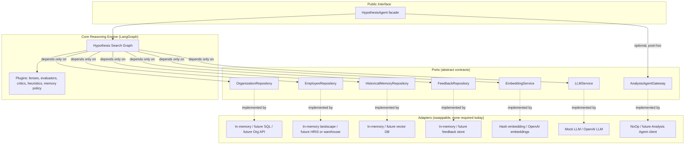
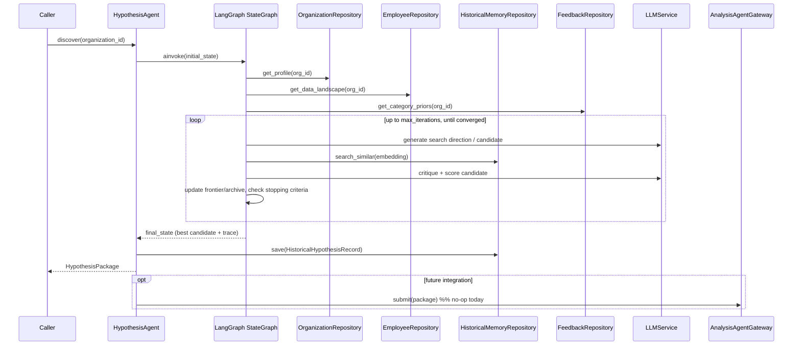
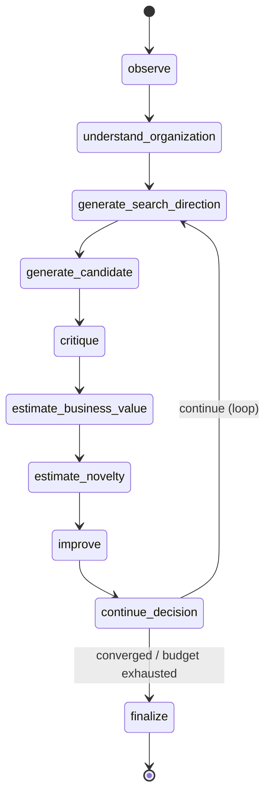
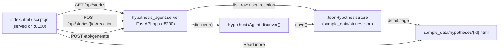

# Hypothesis Agent — Architecture

Status: v0.1 design + reference implementation.
Scope: **only** the Hypothesis Agent. Downstream analysis/statistics/visualization/
recommendation agents are out of scope and are represented solely as an outbound
interface (`AnalysisAgentGateway`) that this service can call once they exist.

> The full downstream pipeline (Investigation Planner → Data Retrieval →
> Analytics → Root Cause → Business Insight → Narrative → Visualization →
> Plot Generation → `InsightPackage`) is now designed in
> [../../docs/PLATFORM_ARCHITECTURE.md](../../docs/PLATFORM_ARCHITECTURE.md) —
> design-only, not yet implemented. This document remains authoritative for
> the Hypothesis Agent itself, which stays fully independent of everything
> described there.

## 1. Purpose and boundaries

The Hypothesis Agent's only job:

> Given an organization, autonomously search the space of possible organizational
> hypotheses and emit **one** high-value, non-obvious, structured hypothesis —
> the *Structured Hypothesis Package* — for downstream agents to analyze.

It does **not**: query real employee rows, run statistics, render charts, write
reports, or talk to end users. It reasons over *metadata about* an organization
(what kinds of data exist, what the org looks like structurally) — never over
raw employee-level records. That's a deliberate boundary, not a missing feature:
row-level analysis is a downstream concern, and keeping the agent blind to raw
data means it can never leak PII and never be tempted to "sneak in" analytics.

Everything the agent depends on outside its own reasoning — data, memory,
embeddings, LLMs, feedback, downstream agents — is reached through a **port**
(an abstract interface). Concrete integrations are **adapters** plugged in
through a dependency-injection container driven by config. No dataset exists
today, so the reference adapters are in-memory/mock implementations; swapping
them for real systems later requires zero changes to the reasoning engine.

## 2. Layered architecture



The reasoning engine (`reasoning/`) imports **only** from `contracts/` and
`ports/` — never from `adapters/`. This is enforced by convention and checked
by a lightweight import-boundary test (`tests/unit/test_architecture_boundaries.py`).

## 3. Component interaction (single `discover()` call)



## 4. LangGraph state graph — the search loop



Node responsibilities (`reasoning/nodes/`):

| Node | Responsibility | Uses |
|---|---|---|
| `observe` | Fetch `OrganizationProfile` + `EmployeeDataLandscape` once; seed lens priors from feedback; initialize search state. | `OrganizationRepository`, `EmployeeRepository`, `FeedbackRepository`, `MemoryPolicy` |
| `understand_organization` | Synthesize a structural/strategic narrative of the org (tensions, structure, goals) that later steps condition on. Pluggable engine — `DeepAgentUnderstandingEngine` (LangChain Deep Agents, sub-agent planning) by default, falls back to `DirectLLMUnderstandingEngine`. | `UnderstandingEngine` port |
| `generate_search_direction` | Pick the next region of hypothesis space to explore: a `BusinessLens` + guiding question, chosen by the `SearchHeuristic` to maximize entropy over already-explored lenses/constructs, weighted by soft feedback priors. May target a fresh lens or mutate a promising archived candidate. | `SearchHeuristic`, lens registry |
| `generate_candidate` | One LLM call turning a directive into a `HypothesisCandidate` (statement + hidden-mechanism explanation + target constructs). | `LLMService`, prompt templates |
| `critique` | Runs the critic chain (self-critique checklist, optional Strands-orchestrated critic) and a near-duplicate check against `HistoricalMemoryRepository` via embeddings. | `Critic` plugins, `EmbeddingService`, `HistoricalMemoryRepository` |
| `estimate_business_value` | Scores business_value, strategic_importance, actionability, organizational_impact, feasibility. | `Evaluator` plugins |
| `estimate_novelty` | Scores novelty, depth, expected_insight, confidence, future_extensibility. | `Evaluator` plugins |
| `improve` | If critique raised fixable issues and score is below threshold, asks the LLM to revise the candidate (new version, same lineage); otherwise passes through. | `LLMService` |
| `continue_decision` | Applies `StoppingCriteria` (convergence window/epsilon, max iterations, frontier exhaustion); updates frontier/archive/best candidate; routes back or to `finalize`. | `StoppingCriteria` |
| `finalize` | Builds the `HypothesisPackage` from the best candidate, trace, and search statistics. | — (pure) |

State shape (`reasoning/state.py::HypothesisSearchState`) is a `TypedDict` so
LangGraph can do partial-key updates per node; every field is a `contracts/`
Pydantic model or a primitive — never a raw dict with implicit shape.

## 5. Class diagram (core types)

```mermaid
classDiagram
    class HypothesisAgent {
        +discover(organization_id) HypothesisPackage
    }
    class AgentDependencies {
        +organization_repository OrganizationRepository
        +employee_repository EmployeeRepository
        +historical_memory_repository HistoricalMemoryRepository
        +feedback_repository FeedbackRepository
        +embedding_service EmbeddingService
        +llm_service LLMService
        +understanding_engine UnderstandingEngine
        +analysis_agent_gateway AnalysisAgentGateway
        +plugins ReasoningPlugins
    }
    class ReasoningPlugins {
        +lenses PluginRegistry~BusinessLens~
        +evaluators PluginRegistry~Evaluator~
        +critics list~Critic~
        +search_heuristic SearchHeuristic
        +memory_policy FeedbackPriorPolicy
    }

    class OrganizationRepository { <<interface>> +get_profile(org_id) OrganizationProfile }
    class EmployeeRepository { <<interface>> +get_data_landscape(org_id) EmployeeDataLandscape }
    class HistoricalMemoryRepository {
        <<interface>>
        +search_similar(embedding, org_id, top_k) list~HistoricalHypothesisRecord~
        +list_recent(org_id, limit) list~HistoricalHypothesisRecord~
        +save(record) None
    }
    class FeedbackRepository {
        <<interface>>
        +get_category_priors(org_id) dict
        +record_feedback(record) None
    }
    class EmbeddingService { <<interface>> +embed(text) list~float~ }
    class LLMService {
        <<interface>>
        +complete(request) LLMResponse
        +complete_structured(request, schema) T
    }
    class AnalysisAgentGateway { <<interface>> +submit(package) AnalysisAgentAcknowledgement }

    class BusinessLens { +id +seed_questions +relevant_construct_categories }
    class Evaluator { <<interface>> +dimension +evaluate(candidate, context) DimensionScore }
    class Critic { <<interface>> +critique(candidate, context, history) CritiqueResult }
    class SearchHeuristic {
        <<interface>>
        +next_lens(state, priors) BusinessLens
        +should_discard(candidate) bool
    }
    class FeedbackPriorPolicy { <<interface>> +compute_lens_priors(org_id) dict }

    class HypothesisCandidate
    class EvaluationScorecard
    class CritiqueResult
    class HypothesisPackage
    class SearchDirective

    HypothesisAgent --> AgentDependencies
    AgentDependencies --> ReasoningPlugins
    AgentDependencies --> OrganizationRepository
    AgentDependencies --> EmployeeRepository
    AgentDependencies --> HistoricalMemoryRepository
    AgentDependencies --> FeedbackRepository
    AgentDependencies --> EmbeddingService
    AgentDependencies --> LLMService
    AgentDependencies --> AnalysisAgentGateway
    ReasoningPlugins --> BusinessLens
    ReasoningPlugins --> Evaluator
    ReasoningPlugins --> Critic
    ReasoningPlugins --> SearchHeuristic
    ReasoningPlugins --> FeedbackPriorPolicy
    HypothesisPackage --> EvaluationScorecard
    HypothesisPackage --> CritiqueResult
    HypothesisCandidate --> EvaluationScorecard
    HypothesisCandidate --> CritiqueResult
    SearchDirective --> BusinessLens
```



## 6. Repository (folder) structure

```
hypothesis_agent/
├── docs/
│   └── ARCHITECTURE.md              # this document
├── examples/
│   └── run_local_demo.py            # end-to-end run, zero network, zero config
├── src/hypothesis_agent/
│   ├── agent.py                     # HypothesisAgent facade — the public interface
│   ├── logging_setup.py
│   ├── config/                      # Config Design (§12)
│   │   ├── settings.py
│   │   └── default.yaml
│   ├── contracts/                   # Data Contracts (§8) — pure Pydantic, no I/O
│   │   ├── organization.py
│   │   ├── hypothesis.py
│   │   ├── memory.py
│   │   └── llm.py
│   ├── ports/                       # Interface Definitions (§7)
│   │   ├── organization_repository.py
│   │   ├── employee_repository.py
│   │   ├── historical_memory_repository.py
│   │   ├── feedback_repository.py
│   │   ├── embedding_service.py
│   │   ├── llm_service.py
│   │   ├── understanding_engine.py
│   │   └── analysis_agent_gateway.py
│   ├── plugins/                     # Plugin-based Architecture (§9)
│   │   ├── registry.py              # generic PluginRegistry[T]
│   │   ├── business_lens.py         # BusinessLens + built-in lens catalog
│   │   ├── evaluators/
│   │   ├── critics/
│   │   ├── search_heuristics/       # entropy-maximizing search heuristic
│   │   └── memory_policies/         # soft-prior feedback policy
│   ├── adapters/                    # concrete, swappable implementations
│   │   ├── repositories/            # in-memory
│   │   ├── embeddings/              # hash (offline) + OpenAI
│   │   ├── llm/                     # mock + OpenAI
│   │   ├── understanding/           # deep-agents + direct-LLM
│   │   └── critique/                # Strands-orchestrated critic
│   ├── reasoning/                   # Core Reasoning Engine — LangGraph
│   │   ├── state.py
│   │   ├── graph.py
│   │   ├── nodes/
│   │   └── search/                  # frontier, scoring, stopping criteria
│   ├── prompts/                     # Prompt Architecture (§10)
│   │   ├── registry.py
│   │   └── templates/*.yaml
│   └── di/
│       └── container.py             # config -> wired AgentDependencies
├── tests/
│   ├── unit/
│   └── integration/
├── pyproject.toml
└── .env.example
```

## 7. Interface definitions (ports)

All ports live in `src/hypothesis_agent/ports/` as `abc.ABC` subclasses with
`async def` methods, typed exclusively in terms of `contracts/` models. Summary:

| Port | Method(s) | Notes |
|---|---|---|
| `OrganizationRepository` | `get_profile(org_id) -> OrganizationProfile` | Structural/strategic metadata only. |
| `EmployeeRepository` | `get_data_landscape(org_id) -> EmployeeDataLandscape` | Schema-level: what attributes exist, coverage, category — **never** row-level data. |
| `HistoricalMemoryRepository` | `search_similar`, `list_recent`, `save` | Backing store for novelty checks and cross-run memory. |
| `FeedbackRepository` | `get_lens_feedback_counts`, `record_feedback` | Raw aggregate counts only; empty repo ⇒ uniform priors once `SoftPriorPolicy` smooths them. |
| `EmbeddingService` | `embed(text) -> list[float]` | Cosine similarity computed centrally in `plugins/critics`. |
| `LLMService` | `complete`, `complete_structured` | `complete_structured` returns a validated Pydantic instance — every LLM call in the graph uses this, never free-text parsing. |
| `UnderstandingEngine` | `understand(profile, landscape) -> OrganizationUnderstanding` | Swappable reasoning strategy (Deep Agents vs. direct LLM). |
| `AnalysisAgentGateway` | `submit(package) -> AnalysisAgentAcknowledgement` | Forward-looking; `NoOpAnalysisAgentGateway` today. |

Every port has exactly one method-group and one reason to change (interface
segregation) — a future "SQL organization repository" only ever implements
`OrganizationRepository`, never a fat multi-purpose interface.

## 8. Data contracts

Core objects, all Pydantic v2 models (`contracts/`):

- **`OrganizationProfile`** — `organization_id`, optional `name`, and an open
  `core_attributes: dict[str, Any]` bag (industry, hierarchy, departments,
  locations, business_goals, competency_framework, ...). No fixed schema.
- **`AttributeField` / `EmployeeDataLandscape`** — a *description* of available
  employee attributes (`name`, `category`, `data_type`, `coverage_ratio`),
  not the attributes themselves. Arbitrary future attributes just add rows.
- **`BusinessLens`** — a named thematic direction (id, seed questions, relevant
  construct categories) — the unit the entropy heuristic diversifies over.
- **`SearchDirective`** — the output of `generate_search_direction`: which lens,
  which guiding question, why.
- **`HypothesisCandidate`** — a search-tree node: statement, mechanism,
  target constructs, lineage (`parent_id`), lifecycle `status`, scorecard,
  critique.
- **`EvaluationScorecard`** — the ten evaluation dimensions (business_value,
  novelty, depth, actionability, strategic_importance, feasibility,
  organizational_impact, expected_insight, confidence, future_extensibility),
  each `0..1`, plus a weighted `composite`.
- **`CritiqueResult`** — structured answers to the internal-critic checklist.
- **`HypothesisPackage`** — the final output contract (see §8.1).
- **`HistoricalHypothesisRecord` / `FeedbackRecord` / `ReasoningTraceEntry`** —
  memory-side contracts, defined even though no store exists yet.

### 8.1 `HypothesisPackage` — the interface to the rest of the platform

```python
class HypothesisPackage(BaseModel):
    package_id: str
    organization_id: str
    generated_at: datetime
    hypothesis_statement: str
    mechanism_explanation: str
    business_lens: str
    target_constructs: list[str]
    proposed_population: str | None
    scorecard: EvaluationScorecard
    critique: CritiqueResult
    reasoning_path: list[ReasoningTraceEntry]
    search_stats: SearchStatistics
    downstream_hints: DownstreamHints   # non-binding suggestions only
    provenance: Provenance
```

`downstream_hints.suggested_analysis_types` is a list of free-text strings
(e.g. `"correlational analysis"`, `"survival analysis"`) — hints, not a
contract the Hypothesis Agent enforces. It must never encode assumptions about
*how* a future Analysis Agent works, only surface what the reasoning process
already noticed. This is the entire coupling surface to the rest of the
pipeline; any future agent consumes this one object and nothing else.

## 9. Plugin-based architecture

Everything extensible is registered in a generic `PluginRegistry[T]`
(`plugins/registry.py`): a dict-backed register/get/all with override control.
Five plugin families ship as first-class extension points:

1. **Business lenses** (`plugins/business_lens.py`) — thematic search regions.
   Ships with ~10 built-ins (burnout/resilience, skill concentration,
   promotion equity, leadership influence, communication-as-protective-factor,
   manager quality, attrition hidden drivers, learning velocity, compensation
   fairness, informal network effects). Adding one is a `registry.register(...)`
   call with no changes to the graph.
2. **Evaluators** (`plugins/evaluators/`) — one per scoring dimension, uniform
   `Evaluator` interface. Mix of `LLMDimensionEvaluator` (config-driven, no new
   class needed for a new LLM-scored dimension) and rule-based evaluators
   (e.g. `FeasibilityFromLandscapeEvaluator`, which scores feasibility from
   `EmployeeDataLandscape.coverage_ratio` with no LLM call).
3. **Critics** (`plugins/critics/`) — `Critic.critique(...)`; a `CriticChain`
   runs several and merges results. Ships `ChecklistCritic` (LLM); the Strands
   adapter (`adapters/critique/strands_critic_orchestrator.py`) is a drop-in
   alternate implementation of the same interface.
4. **Search heuristics** (`plugins/search_heuristics/`) — govern lens
   selection, parent selection, and discard decisions. Ships
   `EntropyMaximizingHeuristic`.
5. **Memory / feedback policies** (`plugins/memory_policies/`) — turn feedback
   history into lens priors. Ships `SoftPriorPolicy`.

Infrastructure backends (repositories, LLM, embeddings, understanding engine)
use the *same* `PluginRegistry`, keyed by a config string, holding factory
callables rather than instances (`di/container.py`). Selecting `llm: openai`
vs `llm: mock` in `config/default.yaml` is the entire integration surface —
the reasoning engine never branches on backend identity.

## 10. Prompt architecture

`prompts/templates/*.yaml`, loaded through `prompts/registry.py::PromptRegistry`:

- Each template file: `id`, `version`, `system`, `user_template` (a
  `string.Template` `$placeholder` body — deliberately not Jinja/f-strings, so
  braces inside LLM-echoed org data can never be misinterpreted as template
  syntax).
- One template per reasoning step that calls the LLM: `understand_organization`,
  `generate_search_direction`, `generate_candidate`, `critique`,
  `estimate_business_value`, `estimate_novelty`, `improve`.
- Templates are versioned so a future prompt-optimization pass (or per-org
  prompt overrides) doesn't require code changes — `PromptRegistry.get(id,
  version="latest")`.
- Every LLM call in the graph pairs a template with a Pydantic response schema
  via `LLMService.complete_structured` — the model never parses free text out
  of a completion.

## 11. Memory architecture

Three independent concerns, three ports, all safe against an empty backing
store:

- **Historical hypotheses** (`HistoricalMemoryRepository`) — used for novelty
  checks (`search_similar`) during `critique`. Empty store ⇒ nothing is "seen
  before," novelty defaults high but not maxed (see `plugins/evaluators`).
- **Feedback → soft priors** (`FeedbackRepository` + `SoftPriorPolicy`) —
  thumbs up/down aggregate *by lens category*, not by literal hypothesis, and
  are converted to a bounded multiplicative prior (`[0.7, 1.3]` by default)
  with Laplace smoothing so an empty repo yields uniform priors and a single
  vote can't collapse a lens to zero. This is explicitly **not** hard learning
  — no weights are trained, no lens is ever fully excluded — see
  `EntropyMaximizingHeuristic`'s exploration floor.
- **Reasoning traces** (`ReasoningTraceEntry`, embedded in `HypothesisPackage`
  and optionally persisted alongside the `HistoricalHypothesisRecord`) — full
  provenance of how the final hypothesis was reached, for auditability and for
  future meta-learning over *why* hypotheses succeeded or failed.

### 11.1 `JsonHypothesisStore` — a real, non-toy implementation of both ports

`adapters/repositories/json_hypothesis_store.py` implements
*both* `HistoricalMemoryRepository` and `FeedbackRepository` against a single
JSON file (`sample_data/stories.json` in the Delphi repo) — the same file the
existing static frontend reads, extended with the fields a hypothesis needs
(`id`, `lens`, `scorecard`, `critique`, `target_constructs`, `search_stats`)
plus a tri-state `reaction: "none" | "up" | "down"`. No in-process cache —
every call reads the file fresh and writes it back atomically
(write-to-temp + `rename`), so it's safe for multiple adapter instances (or
server workers) to point at the same path.

**The dedup guarantee** ("never re-surface a hypothesis already in the
store") is enforced twice, deliberately not left to LLM judgment alone:

1. **Deterministic flagging** (`reasoning/nodes/critique.py`) — after the
   critic chain runs, cosine similarity between the candidate's embedding and
   every `search_similar` result is computed directly; anything at or above
   `search.duplicate_similarity_threshold` (default `0.93`) force-sets
   `critique.similar_to_prior = True`, regardless of what the critic said.
2. **Unconditional discard** (`EntropyMaximizingHeuristic.should_discard`) —
   `similar_to_prior = True` discards the candidate outright, before any
   score-threshold logic runs. `reasoning/search/frontier.py::best_of` was
   fixed to exclude `status == "rejected"` candidates, so a flagged
   near-duplicate can never win a run even if it happened to score highest —
   this was a real bug caught while wiring this guarantee up, not a
   hypothetical one.

**The soft-bias requirement** ("more like what got thumbs up, fewer like
what got thumbs down, but never hard-excluded") needs no new code — it's the
existing `SoftPriorPolicy` + `EntropyMaximizingHeuristic` exploration floor,
now fed by `JsonHypothesisStore.get_lens_feedback_counts`, which aggregates
the `reaction` field by `lens` across the file. These are two independent
mechanisms answering two different questions (*is this the same hypothesis?*
vs. *is this the same flavor of hypothesis the user tends to like?*) and
must not be conflated — the first is a hard filter, the second never is.

## 12. Search algorithm — hypothesis space as heuristic search

Each `HypothesisCandidate` is a search state; `generate_candidate` expands a
state, `critique` + the two `estimate_*` nodes score it, `improve` performs a
local refinement move (same node, revised content), `continue_decision` prunes.

- **Frontier** (`reasoning/search/frontier.py`) — bounded set of live
  candidates; `archive` retains every candidate ever produced (for novelty and
  diversity accounting) even after discard.
- **Diversity enforcement (High Entropy Requirement)** — `EntropyMaximizingHeuristic`
  keeps a running histogram of `(lens, target_construct)` usage across the
  archive and penalizes directives that would over-concentrate on an
  already-heavily-explored region; `generate_search_direction` samples from the
  *least*-explored lenses weighted by (feedback prior × novelty-of-region),
  never purely greedy on score.
- **Composite scoring** (`reasoning/search/scoring.py`) — weighted sum over
  the ten `EvaluationScorecard` dimensions; weights live in config, not code.
- **Stopping criteria** (`reasoning/search/stopping.py`, `StoppingCriteria`) —
  stop when *either*:
  1. **Converged** — best composite score has not improved by more than
     `convergence_epsilon` over the last `convergence_window` iterations, or
  2. **Budget exhausted** — `iteration >= max_iterations`.
  Both are config values (`config/default.yaml`), never hardcoded, so a
  future caller can trade latency for search depth per organization.

## 13. Reasoning workflow (end to end)

```
Organization
   ↓
observe (fetch profile + landscape once, seed priors)
   ↓
understand_organization (narrative synthesis; pluggable Deep Agent)
   ↓
┌─→ generate_search_direction (entropy-maximizing lens choice)
│      ↓
│   generate_candidate (LLM)
│      ↓
│   critique (checklist + novelty check against memory)
│      ↓
│   estimate_business_value  (5 dims)
│      ↓
│   estimate_novelty         (5 dims)
│      ↓
│   improve (conditional local refinement)
│      ↓
│   continue_decision ──────────┐
└──────── loop ──────────────────┘
                                  ↓ (converged / budget exhausted)
                              finalize
                                  ↓
                    Structured Hypothesis Package
                                  ↓
                    (future) Analysis Agent, Statistics Agent,
                    Visualization Agent, Business Consultant Agent,
                    Recommendation Agent
```

## 14. Deep Agents & Strands — where and why

Forcing every node through a heavyweight agent harness would fight the
"explicit LangGraph state graph" requirement and add fragility for no benefit.
Both frameworks are used exactly where they solve a real problem, and always
**behind a port**, with a pure-LLM fallback so the system degrades gracefully
if the optional dependency isn't installed or its API shifts:

- **Deep Agents** (`adapters/understanding/deep_agent_understanding_engine.py`,
  implements `UnderstandingEngine`) powers `understand_organization`. That
  step benefits from planning + sub-agent delegation (e.g. a "structure
  scout" and a "data-landscape scout" sub-agent) because it's the one place
  the agent synthesizes heterogeneous context before any hypothesis exists.
  `create_deep_agent(model=..., tools=[...], system_prompt=...)` is invoked
  once per `discover()` call. Falls back to `DirectLLMUnderstandingEngine`
  (single structured LLM call) if `deepagents` isn't installed.
- **Strands SDK** (`adapters/critique/strands_critic_orchestrator.py`,
  implements `Critic`) is an alternate critic that orchestrates the checklist
  questions as Strands tools with structured output and built-in tracing,
  useful once the critic needs to call out to real tools (e.g. a future
  duplicate-detection service). It's a second implementation of the same
  `Critic` interface used by `ChecklistCritic` — selectable in config,
  chainable with it, not a replacement requirement.

Neither package is a hard dependency of `hypothesis_agent[core]`; both are
optional extras (`hypothesis_agent[deep-agents]`, `hypothesis_agent[strands]`).
Note: `deepagents` currently requires Python ≥3.11; on 3.10 the
`deep-agents` extra simply isn't installable and `DirectLLMUnderstandingEngine`
is used instead — this is exactly the graceful-fallback path the port exists
for, not a workaround.

### 14.1 LiteLLM — the local/testing LLM backend

`adapters/llm/litellm_llm_service.py` (`LiteLLMService`, `backends.llm:
litellm`) is a third `LLMService` implementation, alongside `MockLLMService`
(default, offline) and `OpenAILLMService`. It routes every call through the
`litellm` package's `acompletion`, which accepts a single `api_key` +
`api_base` pair regardless of which underlying provider (or self-hosted
LiteLLM proxy) `llm.model` resolves to — so the same adapter code works
whether the key is for a direct provider or a proxy; only `LITELLM_API_BASE`
changes. Structured output is enforced on our side (`response_format=schema`,
then `json.loads` + `schema.model_validate`) rather than assumed from the
framework, since litellm returns a JSON string, not a parsed object like the
OpenAI SDK's `.parse()`.

The default model (`llm.model` in `config/default.yaml`) is the cheapest
practical OpenAI-compatible chat model, since this project is explicitly at
the testing stage — cost-per-call matters more than output quality right
now. Bump it once past testing; nothing else changes.

**Concrete deployment**: `.env` is pre-configured for the SHL internal
LiteLLM endpoint (`LITELLM_API_BASE=https://labs.shl.com/llm-internal/`,
`HYPOTHESIS_AGENT__BACKENDS__LLM=litellm` — active by default, only
`LITELLM_API_KEY` is left for the developer to fill in). This is why
`examples/run_local_demo.py` and every test that needs to stay offline
explicitly force `backends.llm = "mock"` / `backends.embedding = "hash"` in
code rather than relying on `AgentConfig.load()`'s ambient result — a local
`.env` genuinely changes that result now, so anything that must be
deterministic/offline can't assume it.

## 15. Configuration design

`config/settings.py` — plain Pydantic `BaseModel`s (`AgentConfig.load()`),
loaded from `config/default.yaml` and overridable per-field via
`HYPOTHESIS_AGENT__*` environment variables, deep-merged over the YAML
(e.g. `HYPOTHESIS_AGENT__SEARCH__MAX_ITERATIONS=12`). Sections:

- `search`: `max_iterations`, `convergence_window`, `convergence_epsilon`,
  `exploration_floor`.
- `scoring`: per-dimension weights (must sum to 1.0, validated).
- `backends`: `llm` (`mock` / `openai` / `litellm`), `embedding`
  (`hash` / `openai`), `understanding_engine`, `critics` (list),
  `historical_memory_repository` / `feedback_repository`
  (`in_memory` / `json_file`), `json_store_path` — each a registry key (or,
  for the JSON path, a plain setting) resolved by `di/container.py`.
- `llm`: model name, temperature, timeout — per backend.
- `logging`: level, structured (bool).

No secrets in YAML — API keys are env-only, loaded from `hypothesis_agent/.env`
(`python-dotenv`, never overriding an already-exported var) and read by the
adapter: `OPENAI_API_KEY` for the OpenAI backends, `LITELLM_API_KEY` /
`LITELLM_API_BASE` for `LiteLLMService` (§14.1).

## 16. Testing strategy

- **Unit** (`tests/unit/`): contracts validate (round-trip + boundary values),
  `PluginRegistry` register/override/get, `EntropyMaximizingHeuristic`
  diversity behavior (never re-picks the same lens twice in a row when
  alternatives exist), `SoftPriorPolicy` (empty repo ⇒ uniform; lopsided
  feedback ⇒ bounded, never zero), `StoppingCriteria` (both branches),
  `scoring.composite_score` (weights sum to 1, monotonicity).
- **Integration** (`tests/integration/`): full graph `ainvoke` using only
  in-memory adapters + `MockLLMService`/`HashEmbeddingService` — no network,
  no API key, deterministic — asserts a valid `HypothesisPackage` is produced,
  respects `max_iterations`, and that two consecutive candidates never reuse
  the same lens (entropy requirement, observable end-to-end).
- **Architecture boundary test**: static check that nothing under
  `reasoning/` or `contracts/` imports from `adapters/`.
- **`JsonHypothesisStore`** (`tests/unit/test_json_hypothesis_store.py`):
  save/list round-trip, reaction default/update, per-lens feedback
  aggregation, invalid-reaction rejection, missing-file/unknown-id handling —
  all against `tmp_path`, never the real `sample_data/stories.json`.
- **Dedup correctness** (`tests/unit/test_dedup_guard.py`): a candidate
  flagged `similar_to_prior` is discarded regardless of score, and
  `best_of()` never returns a rejected candidate.
- **Server** (`tests/integration/test_server_api.py`): the FastAPI app
  end-to-end via `TestClient`, redirected to a `tmp_path` JSON store through
  `HYPOTHESIS_AGENT__BACKENDS__JSON_STORE_PATH` — health, empty-feed state,
  generate → appears in the feed, reaction round-trip, 404 on an unknown id.
- Real-backend adapters (OpenAI LLM/embeddings, Deep Agents, Strands) are
  exercised only in an opt-in `tests/integration/test_live_backends.py`
  skipped unless `RUN_LIVE_TESTS=1` and the relevant API key is present.

## 17. Future integration strategy

- **Real data sources**: implement `OrganizationRepository`/`EmployeeRepository`
  against the eventual HRIS/warehouse; register in `di/container.py`; no
  reasoning-layer change. `EmployeeDataLandscape`'s open `AttributeField` list
  means new competency/psychometric attributes need zero contract changes.
- **Historical hypothesis DB**: `JsonHypothesisStore` (§11.1) is already a
  real, working `HistoricalMemoryRepository`; swap it for a vector store
  (e.g. pgvector/Pinecone) once file-based storage or per-call re-embedding
  of every existing entry stops scaling — `search_similar`'s embedding-based
  contract doesn't change, only the adapter.
- **Feedback loop**: `JsonHypothesisStore` is already a real
  `FeedbackRepository`, backed by the frontend's own reaction data; swap for
  a dedicated feedback store once volume outgrows a flat file.
  `SoftPriorPolicy` already degrades gracefully from zero to large sample
  sizes either way.
- **Downstream agents**: implement `AnalysisAgentGateway.submit()` to actually
  enqueue/call the first downstream agent. `HypothesisPackage` is the entire
  contract surface — downstream agents are written against it without ever
  importing `hypothesis_agent` internals.
- **Multi-agent orchestration**: because the facade (`HypothesisAgent.discover`)
  is a plain async function returning a Pydantic model, it can be wrapped as
  a LangGraph node, a Strands tool, or an HTTP/queue endpoint in a future
  orchestrator with no internal changes.

## 18. Frontend integration: the live JSON feed & local API server

The Delphi repo already had a static, backend-free news-brief frontend
(`index.html`/`script.js`/`styles.css`, reading a seed `sample_data/stories.json`).
Rather than build that frontend's data layer twice, `JsonHypothesisStore`
(§11.1) targets that exact file's schema, extended with the fields a
hypothesis needs — so the existing Cards/Headlines UI becomes the Hypothesis
Agent's live feed with no parallel data model.



- **`src/hypothesis_agent/server/app.py`** — a small FastAPI app, the one
  other module (besides `di/container.py`) allowed to hold a concrete
  adapter reference directly. Three routes: `GET /api/stories` (raw feed),
  `POST /api/stories/{id}/reaction` (tri-state, backed by
  `FeedbackRepository.record_feedback`), `POST /api/generate` (runs
  `HypothesisAgent.discover()` end to end). CORS-open for local dev.
- **`adapters/rendering/detail_page_renderer.py`** — turns a
  `HistoricalHypothesisRecord` into the static "read more" page
  (`JsonHypothesisStore.save()` writes it alongside the JSON entry): hidden
  mechanism, all ten scorecard dimensions as bars, the internal critique,
  and search statistics — the full reasoning result, not just the headline.
- **`script.js`** fetches `/api/stories` live instead of embedding data, and
  posts reactions to `/api/stories/{id}/reaction` instead of writing only to
  `localStorage` (kept as an offline mirror, not the source of truth). If
  the API is unreachable — page opened from disk, server not running — it
  falls back to a small embedded story deck, preserving the original
  zero-backend usage mode. A "+ Generate hypothesis" button in the header
  drives `POST /api/generate` directly from the UI.
- Run it: `cd Delphi/ && python -m hypothesis_agent.server` (serves the API
  on `:8200`; the static site is still served separately per the top-level
  README, e.g. `python3 -m http.server 8100`).

## 19. Implementation roadmap

1. **Done**: contracts, ports, plugin registry + built-in plugins,
   in-memory/mock adapters, LangGraph search loop, config, prompts, tests,
   `examples/run_local_demo.py`.
2. **Done**: a real (file-based, not yet vector-indexed) `HistoricalMemoryRepository`
   + `FeedbackRepository` — `JsonHypothesisStore` — plus a local FastAPI
   server and live frontend wiring, so the loop is genuinely end-to-end
   testable today, not only against in-memory fixtures.
3. **Next**: wire a real LLM in production use (`LiteLLMService` is already
   built for local/testing use — see §14 for the equivalent Deep Agents/Strands
   pattern); tune scoring weights and convergence params against real LLM
   output variance instead of `MockLLMService`'s calibrated-but-fake scores.
4. **Then**: first real `OrganizationRepository`/`EmployeeRepository` adapter
   against a pilot organization's data; validate `EmployeeDataLandscape`
   coverage against real attribute sets.
5. **Then**: replace `JsonHypothesisStore` with a real vector store
   (pgvector/Pinecone) once the JSON file's scale or concurrency needs
   outgrow it — `search_similar`'s embedding-based contract doesn't change,
   only the adapter.
6. **Then**: implement the first downstream Analysis Agent against
   `HypothesisPackage` and a real `AnalysisAgentGateway.submit()`.
7. **Ongoing**: grow the business-lens catalog and evaluator set as plugins
   based on which hypotheses downstream agents/executives actually found
   valuable (tracked via feedback, never via hardcoded logic changes).
